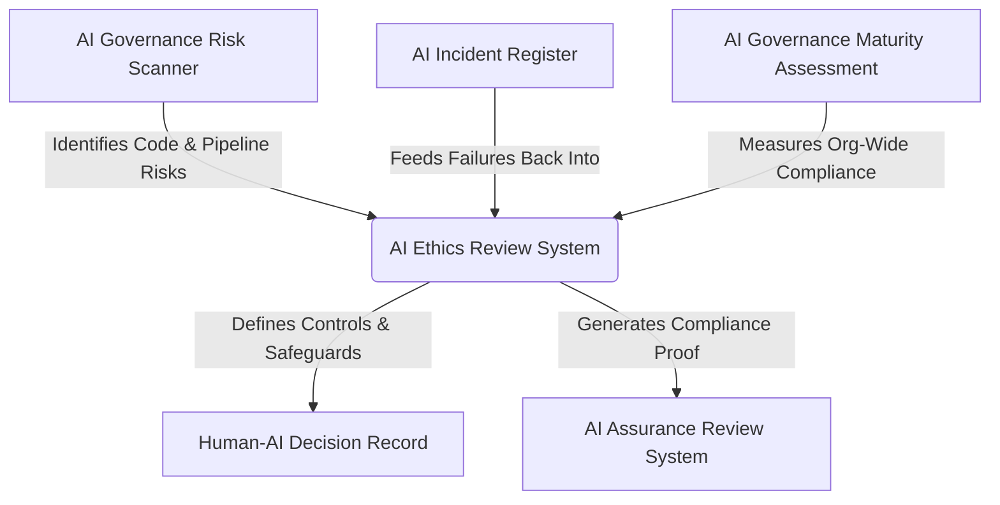

# Project Specification: CloudPedagogy AI Ethics Review

## Project Overview
The **CloudPedagogy AI Ethics Review** is a local-first, privacy-respecting, and highly configurable governance tool designed for the structured ethical evaluation of AI-supported systems, workflows, and outputs. In an era where AI tools are rapidly integrated into operations—specifically in academic, research, and enterprise environments—this application provides a transparent, repeatable mechanism for assessing ethical implications, capturing qualitative justifications, and producing audit-ready reports.

Crucially, the application operates entirely within the user's browser (local-first design), ensuring that sensitive operational metadata, proprietary workflow details, and ethical discussions never leak to third-party servers.

---

## Purpose and Rationale
Organizations face a major challenge: how to adopt AI systems rapidly while ensuring compliance with ethical standards and legal regulations without adding undue administrative overhead. The AI Ethics Review tool addresses this by:
1. **Standardizing Assessment**: Moving ethical reviews away from ad-hoc discussions and into structured, repeatable frameworks.
2. **Ensuring Transparency**: Providing a clear, mathematical calculation of risk through a weighted criteria scoring system, paired with explicit conditional rules.
3. **Preserving Privacy**: Reviewing sensitive systems locally, making it safe to assess internal tools or proprietary research.
4. **Providing Governance Proof**: Generating clean, audit-ready reports that can be printed to PDF or version-controlled as JSON files.

---

## Ethical Review Philosophy
Ethical review is not a box-ticking exercise; it is an active risk management and alignment strategy. The tool is built upon the philosophy that:
* **Ethics is Multi-Dimensional**: A single risk score is insufficient. A system might have excellent data privacy but fail on human oversight or academic integrity.
* **Context is Key**: A tool that is safe for administrative scheduling might be highly dangerous when used for student grading. The review framework must adapt to the system's context.
* **Qualitative & Quantitative Coexist**: Numeric scores allow comparison and dashboarding, but the qualitative justification (evidence/notes) provides the actual context and accountability.

---

## Position within the CloudPedagogy Governance Ecosystem
The CloudPedagogy AI Ethics Review fits into a broader suite of governance engineering tools, each addressing a distinct phase of the AI lifecycle:



### The Ecosystem Components
1. **AI Governance Risk Scanner**: Automates risk discovery in codebases, configurations, and data pipelines (static analysis).
2. **AI Ethics Review System (This Tool)**: The qualitative gateway where human reviewers evaluate the system's compliance with organizational values before, during, or after deployment.
3. **Human–AI Decision Record**: Captures the operational, day-to-day decisions where humans override or validate AI suggestions.
4. **AI Incident Register**: Tracks failures, anomalies, and harms, feeding real-world incidents back into the Ethics Review to refine criteria and rules.
5. **AI Assurance Review System**: Manages formal compliance checks, third-party audits, and certification tracking.
6. **AI Governance Maturity Assessment**: Evaluates the organizational maturity and alignment across all governance dimensions.

### Contribution to Core Governance Pillars
* **Governance**: Standardizes the rules, thresholds, and safeguards that AI systems must adhere to, acting as a gatekeeper.
* **Assurance**: Captures the concrete evidence (justifications) showing that an AI system was systematically evaluated against predefined criteria.
* **Accountability**: Documents the reviewer, review date, and explicit reasoning behind each score, making the audit trail fully transparent.
* **Transparency**: Explains exactly how a risk rating was generated, showing the breakdown of criteria contributions, triggered rules, and required safeguards.
* **Responsible AI Adoption**: By offering a clear, frictionless review process, it lowers the barrier to compliance, encouraging teams to assess systems early and often.

---

## Core Use Cases
1. **Academic Integrity Reviews**: Higher education institutions reviewing AI-assisted grading, exam proctoring, or admissions screening tools.
2. **Research Ethics Approval**: Institutional Review Boards (IRBs) evaluating AI usage in academic research, ensuring data protection and subject consent.
3. **Internal Tool Procurement**: IT and governance teams reviewing commercial AI platforms (e.g., Copilots, CRM AI features) before licensing.
4. **Student Project Gatekeeping**: Assessing student-led AI startups or research projects prior to deployment on university servers.

---

## Functional Requirements
* **Framework Management**: Build, customize, duplicate, and delete frameworks. Preconfigured with a *Default Ethics Framework* and a *Higher Education Framework*.
* **Criteria Configurations**: Add and configure criteria within frameworks, detailing their title, description, weight, category, and display order.
* **Scoring Scales**: Supports numeric scales (e.g., 0–3) with custom labels (e.g., "Unacceptable / High Risk" to "Excellent / No Risk").
* **Threshold System**: Custom ranges mapping percentage scores to recommendation levels (`Low Risk`, `Moderate Risk`, `High Risk`, `Critical Risk`).
* **Conditional Rules Engine**: Define red-flag rules (e.g., "If human oversight is less than 2, override overall recommendation to Critical Risk").
* **Evidence Collection**: Gather system information (name, purpose, description) and force qualitative justification notes for every criterion score.
* **Report Visualizations**: Display a comprehensive score contribution table, highlight triggered red-flag rules, list required safeguards, and show the final recommendation.
* **Data Portability**: Export and import the entire state (frameworks and reviews) as a JSON file, or print the review report to PDF.

---

## Non-Functional Requirements
* **Local-First & Offline Functionality**: Zero external backend APIs. Works completely offline to guarantee data privacy.
* **Aesthetics and Usability**: Responsive dashboard, interactive tables, and clean forms using a professional dark/slate color scheme and high-contrast elements.
* **Performance**: Sub-millisecond scoring and rule execution because all calculations happen client-side.
* **Portability**: Packaged as a static web application that can be run locally or hosted on any basic web server (e.g., AWS S3, GitHub Pages).

---

## Architecture
The application is structured as a client-side React single-page application (SPA).

```
+-----------------------------------------------------------+
|                        Vite App                           |
+-----------------------------------------------------------+
|                                                           |
|  +--------------------+             +------------------+  |
|  |     React Pages    |             |  Zustand Store   |  |
|  |  (Dashboard, New   | <=========> |    (useStore)    |  |
|  |   Review, Report)  |             +--------+---------+  |
|  +---------+----------+                      |            |
|            |                                 v            |
|            v                         +---------------+    |
|  +--------------------+              |  Persist MW   |    |
|  |    UI Components   |              +-------+-------+    |
|  |   (Card, Button)   |                      |            |
|  +--------------------+                      v            |
|                                      +---------------+    |
|                                      | localStorage  |    |
|                                      +---------------+    |
+-----------------------------------------------------------+
```

* **Core Framework**: React 19 and TypeScript.
* **Build Tool**: Vite.
* **State Management**: Zustand with `persist` middleware, storing JSON data in the browser's `localStorage`.
* **Icons**: Lucide React.
* **Date Manipulation**: Date-fns.

---

## Review Framework Model
A framework is defined by the following structure:
```typescript
interface Framework {
  id: string;
  name: string;
  description: string;
  isDefault?: boolean;
  criteria: Criterion[];
  rules: Rule[];
  safeguards: Safeguard[];
  thresholds: Threshold[];
}
```
* **Criteria**: The evaluation standards.
* **Rules**: Overrides representing specific conditions that flag extreme risks.
* **Safeguards**: Required mitigation practices (e.g., human-in-the-loop, bias audits).
* **Thresholds**: Score ranges mapped to risk categories.

---

## Criteria and Weighting System
Each criterion contains a weight representing its relative importance within the framework:
* **Criterion Structure**:
  ```typescript
  interface Criterion {
    id: string;
    title: string;
    description: string;
    weight: number; // e.g. 1 to 5
    scoringScale: ScoringScale;
    guidanceNotes: string;
    category?: string;
    displayOrder: number;
  }
  ```
* **Weighting Impact**: Higher weight multiplies the score contribution, giving that specific criterion a greater impact on the final percentage score.

---

## Scoring Methodology
The system calculates scores using a weighted-sum percentage:

1. **Calculate Score Contribution** for each criterion:
   $$\text{Contribution} = \text{Score} \times \text{Weight}$$
2. **Calculate Total Weighted Score**:
   $$\text{Total Score} = \sum (\text{Score}_i \times \text{Weight}_i)$$
3. **Calculate Maximum Possible Score**:
   $$\text{Max Possible Score} = \sum (\text{Max Score}_i \times \text{Weight}_i)$$
4. **Calculate Final Percentage**:
   $$\text{Percentage} = \frac{\text{Total Score}}{\text{Max Possible Score}} \times 100$$
5. **Evaluate Thresholds**: Compare the final percentage against configured thresholds to assign the baseline recommendation.
6. **Evaluate Override Rules**: Check if any triggered conditional rules recommend a higher risk category than the baseline. If yes, the rule override becomes the final recommendation.

---

## Evidence Capture Framework
Reviewers must provide both quantitative and qualitative inputs:
* **Quantitative**: Selection of a score option from a predefined list (e.g. 0 to 3).
* **Qualitative**: Textual entry under **Notes / Justification**. A review cannot be completed without recording the rationale for each score, ensuring the audit trail remains meaningful.
* **System Metadata**: Contextual details including the AI System, operational description, and purpose.

---

## Reporting Features
The report view (`ReviewReport.tsx`) provides:
* **Risk Summary**: High-contrast badge showing the risk level.
* **Interactive Score Contribution**: Breakdown showing points earned and weight factors.
* **Justification Log**: Listing the qualitative notes next to each criterion.
* **Red Flag Alerts**: Details of any rule that was triggered and triggered an override.
* **Required Safeguards List**: Outlining the precise operations required to mitigate risks (e.g., bias monitoring, student disclosure).
* **Print Optimization**: A stylesheet hiding navigation elements and resizing components to fit A4 paper when printed or saved as PDF.

---

## Local Storage Strategy
* **Technology**: Zustand `persist` middleware.
* **Storage Namespace**: `ethics-review-storage`.
* **State Operations**:
  - `addFramework` / `updateFramework` / `deleteFramework` immediately write to browser storage.
  - `addReview` stores completed reviews locally.
  - `resetToDefaults` wipes local storage, re-injecting the original hardcoded frameworks.

---

## Export Formats
* **JSON (ethics-framework.json)**: Fully serialized AppState. Reviewers can export their evaluations, and other team members can import the file to reconstruct the reviews and custom frameworks on their own machine.
* **PDF (via Browser Print)**: A visual report containing the system name, reviewer, scores, justifications, triggered rules, and required safeguards.

---

## Governance and Assurance Applications
* **Assurance Artifacts**: Reviews can be exported as JSON and committed directly to the git repository of the AI project. This treats "Ethics-as-Code," allowing changes in ethical reviews to be tracked using standard git diffs over time.
* **Audit Trail**: The printout or JSON acts as evidence of compliance for internal audits, steering committees, or accreditation bodies.

---

## Deployment Model
* **Hosting**: The built folder (`dist/`) contains purely static HTML, JS, and CSS files.
* **Platform**: Deployed to an AWS S3 bucket configured for Static Website Hosting.
* **URL**: [Live Application](http://cloudpedagogy-ai-ethics-review.s3-website.eu-west-2.amazonaws.com/#/frameworks)
* **Access**: No database credentials or server configurations required. Highly scalable and cost-effective.

---

## Future Roadmap
1. **Git Integration**: Directly save reviews and custom frameworks to a git repository using browser-based git protocols.
2. **Peer Review Workflows**: Allow multiple reviewers to import and merge their reviews of the same system, calculating consensus or identifying divergences.
3. **Framework Marketplace**: Share custom frameworks (e.g., medical research frameworks, corporate hiring frameworks) via a public JSON repository.
4. **Detailed Rule Builder**: Expand the rule engine to support complex nested logical operations (AND/OR groups) and text parsing conditions in the UI.
