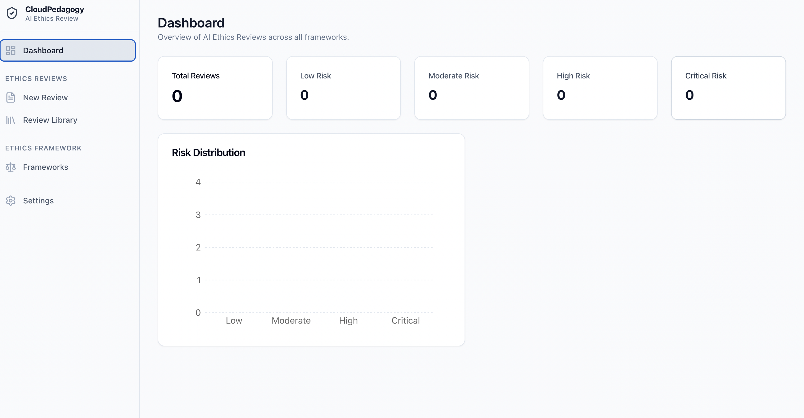
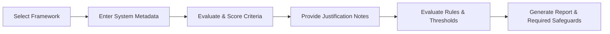

# CloudPedagogy AI Ethics Review

Local-first governance tool for structured ethical review of AI-supported systems, workflows, and outputs using configurable frameworks, transparent scoring, evidence capture, and governance-ready reporting.

🌐 Live Hosted Version:
http://cloudpedagogy-ai-ethics-review.s3-website.eu-west-2.amazonaws.com/#/frameworks

🖼️ Screenshot:


---

## Overview
The **CloudPedagogy AI Ethics Review** tool is a specialized, local-first web application designed to bridge the gap between AI technical capability and ethical accountability. It allows administrators, researchers, educators, and governance teams to systematically evaluate the ethical dimensions of AI-supported tools and workflows. By utilizing customizable frameworks, weighted scoring scales, rule overrides, and mandatory evidence logs, organizations can transform subjective ethical principles into structured, auditable governance data.

---

## Key Features
* **Custom Framework Builder**: Create, duplicate, and modify ethical frameworks tailored to specific regulatory, academic, or corporate requirements.
* **Weighted Criteria Scoring**: Adjust criteria weighting to ensure higher-impact issues (e.g., student privacy or algorithmic bias) carry proportionate influence.
* **Conditional Rules Engine**: Establish red-flag rule overrides (e.g., "Critical Risk" overrides if human oversight is completely absent).
* **Mandatory Evidence Capture**: Force text justification for numeric scores to build a meaningful, qualitative audit trail.
* **Interactive Dashboard**: View historical reviews, track system risks, and analyze score distributions across multiple projects.
* **Local-First & Offline-Capable**: All data stays inside the browser's local storage—zero external APIs, ensuring complete data privacy.
* **PDF Report Generation**: Export beautiful, print-optimized reviews detailing final scores, justifications, triggered rules, and safeguards.
* **Data Portability**: Import and export database configurations via standard JSON files.

---

## Ethical Review Workflow

1. **Choose Framework**: Select a template (e.g., Higher Education, General Ethics) matching the system's deployment context.
2. **Specify Metadata**: Log the system title, AI engine used, description, purpose, and stakeholders.
3. **Score Criteria**: Evaluate criteria scoring scales from 0 (High Risk) to 3 (No Risk).
4. **Capture Evidence**: Document textual justifications for each score.
5. **Review Report**: The system calculates the weighted score percentage, applies threshold levels, triggers any red flags, and prescribes necessary safeguards.
6. **Publish / Export**: Print to PDF or download the evaluation JSON to store in project repositories.

---

## Governance Applications
* **Academic Course Integration**: Assures course leaders and university boards that student-facing generative AI assistants are ethically sound.
* **Ethics Board Auditing (IRB)**: Provides researchers with structured reports verifying data minimization and participant protection.
* **Procurement Compliance Gate**: Serves as a qualitative evaluation hurdle that vendor AI tools must pass before integration.
* **Ethics-as-Code Integration**: The exported JSON files can be checked into git repositories alongside source code, tracking ethical review changes across system versions.

---

## Review Framework Builder
The Framework Builder gives users total control over ethical assessments:
* **Tabs-based configuration**: Define general settings, criteria lists, risk thresholds, rule overrides, and required safeguards.
* **Interactive Addition/Deletion**: Add new evaluation criteria to frameworks with custom weights and display orders.
* **Duplication System**: Clone existing frameworks with a single click to experiment with different scoring scales or weightings.

---

## Scoring and Assessment
The scoring engine computes a weighted percentage using the following formulas:

$$\text{Criterion Score Contribution} = \text{Score} \times \text{Weight}$$
$$\text{Total Score} = \sum (\text{Score}_i \times \text{Weight}_i)$$
$$\text{Maximum Possible Score} = \sum (\text{Max Score}_i \times \text{Weight}_i)$$
$$\text{Percentage Score} = \frac{\text{Total Score}}{\text{Max Possible Score}} \times 100$$

* The percentage score maps directly to baseline **Threshold Recommendation Levels** (e.g. 0-25% = Critical Risk, 76-100% = Low Risk).
* If a conditional rule evaluates to true (e.g., a critical criterion scores too low), an **override recommendation** is triggered to elevate the risk tier.

---

## Evidence Capture
The tool enforces a strict two-part validation system:
1. **Quantitative Score**: A rigid rating that classifies the performance level of a system under a specific criterion.
2. **Qualitative Justification**: An open-text notes section where the reviewer enters the concrete evidence, observations, or mitigation actions that justify the rating. This text is displayed in the final report to prevent scoring from becoming an empty exercise.

---

## Reporting and Exports
* **Print-to-PDF**: Print layout CSS automatically adapts the interface to a clean, white-page layout with headers, signatures, and page breaks suitable for formal distribution.
* **JSON Backups**: Easily download your state from Settings (`ethics-framework.json`) and share it with peers who can upload it into their local browsers.

---

## Technology Stack
* **Vite**: High-performance frontend bundler.
* **React 19**: Modern declarative UI framework.
* **TypeScript**: Type-safe application logic.
* **Zustand**: Lightweight, reactive state management.
* **Zustand Persist Middleware**: Automatic serialization of application state to the browser's `localStorage`.
* **Tailwind CSS**: Sleek utility styling.
* **Lucide React**: Clean vector iconography.
* **Date-fns**: Robust date formatting.

---

## Local-First Design Principles
The AI Ethics Review application is built with an offline-first design philosophy:
* **Zero Network Requests**: The app makes no API calls to save, load, or process data.
* **Zero Latency**: Calculations, page transitions, and saving are instantaneous.
* **Data Control**: Your data never leaves your computer, making it compliant with strict intellectual property and GDPR frameworks.
* **Resilience**: The tool remains functional even in environments with no internet access.

---

## Installation
Ensure you have [Node.js](https://nodejs.org/) (version 18+) and npm installed.

Clone this repository and install dependencies:
```bash
git clone https://github.com/cloudpedagogy/cloudpedagogy-ai-ethics-review.git
cd cloudpedagogy-ai-ethics-review
npm install
```

---

## Running Locally
Start the local development server:
```bash
npm run dev
```
Open your browser and navigate to:
[http://localhost:5173/](http://localhost:5173/)

---

## Building for Production
To build the application for production deployment (generates static assets in `dist/`):
```bash
npm run build
```

---

## AWS S3 Deployment
The static build folder (`dist/`) can be deployed to an AWS S3 bucket for static website hosting:

1. Build the production assets: `npm run build`
2. Sync files to S3:
   ```bash
   aws s3 sync dist/ s3://your-ethics-review-bucket --delete
   ```
3. (Optional) Invalidate CloudFront distribution:
   ```bash
   aws cloudfront create-invalidation --distribution-id YOUR_DIST_ID --paths "/*"
   ```

---

## Export Options
1. **JSON Configuration**: Located in **Settings** > **Export Configuration**. Outputs a schema-compliant JSON file containing all customized frameworks and reviews.
2. **Print/PDF**: Located on any individual report page. Triggering the **Print PDF** button formats the review page for clean printing or saving via the browser's built-in print dialog.

---

## Repository Structure
```
├── assets/                 # Graphics assets (e.g. screenshot.png)
├── public/                 # Static public files (favicon, etc.)
├── src/
│   ├── components/         # Reusable UI & domain-specific components
│   │   ├── framework/      # Framework builder tabs and editors
│   │   ├── layout/         # Sidebar, header, page layouts
│   │   └── ui/             # Core design components (buttons, cards)
│   ├── models/             # TypeScript type definitions (types.ts)
│   ├── pages/              # Primary route views (Dashboard, Reviews, etc.)
│   ├── store/              # Zustand global state (useStore.ts, defaultData.ts)
│   ├── App.css             # Main stylesheet
│   ├── App.tsx             # Route management & base layout
│   ├── index.css           # Tailwind CSS directives
│   └── main.tsx            # Application mounting file
├── index.html              # HTML shell
├── package.json            # Build scripts and dependencies
├── tailwind.config.js      # Tailwind style tokens
├── tsconfig.json           # TS base compiler options
└── vite.config.ts          # Vite compiler plugins and configurations
```

---

## Roadmap
1. **CRDT Syncing**: Enable real-world collaboration between offline-first nodes using P2P synchronization.
2. **Enhanced Rules Syntax**: Support numerical comparisons, regex text parsing, and compound condition rules in the user interface.
3. **Framework Repository**: Connect to a community-driven repository to download industry-standard ethical frameworks (such as IEEE, EU AI Act, and NIST).
4. **Git Integration**: Push evaluations and frameworks directly to GitHub or GitLab repositories from settings.

---

## License
Licensed under the [MIT License](LICENSE).
